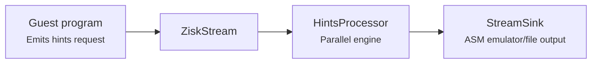
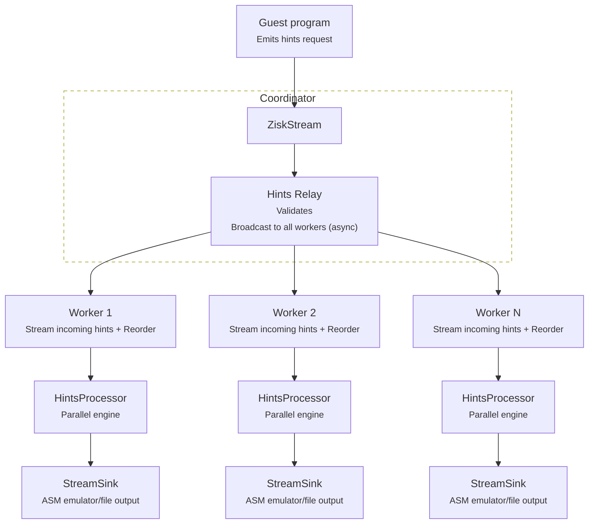

# Precompile Hints System

Cryptographic precompiles (SHA-256, Keccak-256, elliptic curve operations, pairings, etc.) are computationally expensive inside a zkVM. The precompile hints system accelerates proof generation by offloading these expensive computations outside the zkVM execution, then feeding the results back as verifiable data through a high-performance, parallel pipeline. Hints are preprocessed results that allow cryptographic operations to be handled externally while remaining fully verifiable inside the VM. The system is designed around three core principles:

1. **Pre-computing results outside the VM**: The guest program emits hint requests describing the operation and its inputs.
2. **Streaming results back**: A dedicated pipeline processes these requests in parallel, maintaining order, and feeds results to the prover via shared memory.
3. **Verifying inside the VM**: The zkVM circuits verify that the precomputed results are correct, avoiding the cost of computing them inside the zkVM.



---

## Table of Contents

1. [Hint Format and Protocol](#1-hint-format-and-protocol)
2. [Hints in CLI Execution](#2-hints-in-cli-execution)
3. [Hints in Distributed Execution](#3-hints-in-distributed-execution)
4. [Custom Hint Handlers](#4-custom-hint-handlers)

---

## 1. Hint Format and Protocol

### 1.1. Hint Request Format
Hints are transmitted as a stream of `u64` values. Each hint request consists of a **header** (1 `u64`) followed by **data** (N `u64` values).

```
┌─────────────────────────────────────────────────────────────┐
│                         Header (u64)                        │
├·····························································┤
│      Hint Code (32 bits)           Length (32 bits).        │
├─────────────────────────────────────────────────────────────┤
│                        Data[0] (u64)                        │
├─────────────────────────────────────────────────────────────┤
│                        Data[1] (u64)                        │
├─────────────────────────────────────────────────────────────┤
│                             ...                             │
├─────────────────────────────────────────────────────────────┤
│                     Data[length-1] (u64)                    │
└─────────────────────────────────────────────────────────────┘
```
- **Hint Code** (upper 32 bits): Control code or Data Hint Type
- **Length** (lower 32 bits): Payload data size in **bytes**. The last `u64` may contain padding bytes.

### 1.2. Control Hint Types:
The following control codes are defined:
- `0x00` (START): Start a new hint stream. Resets processor state and sequence counters. Must be the first hint in the first batch.
- `0x01` (END): End the current hint stream. The processor will wait for all pending hints to be processed before returning. Must be the last hint in its batch; only a `CTRL_START` may follow in a subsequent batch.
- `0x02` (CANCEL): **[Reserved for future use]** Cancel current stream and stop processing further hints.
- `0x03` (ERROR): **[Reserved for future use]** Indicate an error has occurred; stop processing further hints.

Control codes are for control only and do not have any associated data (Length should be zero).

### 1.3. Data Hint Types
For data hints, the hint code (32 bits) is structured as follows:
- **Bit 31 (MSB)**: Pass-through flag. When set, the data bypasses computation and is forwarded directly to the sink.
- **Bits 0-30**: The hint type identifier (control, built-in, or custom code).
  (e.g., `HINT_SHA256`, `HINT_BN254_G1_ADD`, `HINT_SECP256K1_RECOVER`, etc.)

**Example**: A SHA-256 hint (`0x0100`) with a 32-byte input:
```
Header: 0x00000100_00000020
Data[0]: first_8_input_bytes_as_u64
Data[1]: next_8_input_bytes_as_u64
Data[2]: next_8_input_bytes_as_u64
Data[3]: last_8_input_bytes_as_u64
```

The same hint with the **pass-through flag** set (bit 31), forwarding pre-computed data directly to the sink without invoking the SHA-256 handler:
```
Header: 0x80000100_00000020
```

#### 1.3.1 Stream Batching
The hints protocol supports chunking for individual hints that exceed the transport’s message size limit (currently 128 KB). Each message in the stream contains either a single complete hint or one chunk of a larger hint — hints are never combined in the same message.

When a hint exceeds the size limit, it must be split into multiple sequential chunks, each sent as a separate message. Each chunk includes a header specifying the total length of the complete hint, allowing the receiver to reassemble all chunks before processing. For example, a hint with a 300 KB payload would be split into three messages:
```Message 1: Header (code + total length), Data[0..N] (first 128 KB chunk)
Message 2: Header (code + total length), Data[0..N] (second 128 KB chunk)
Message 3: Header (code + total length), Data[0..M] (final 44 KB chunk)
```
The receiver buffers incoming chunks and reassembles them based on the total length specified in the header before invoking the hint handler. This allows the system to handle arbitrarily large hints while respecting transport limitations.

#### 1.3.2 Pass-Through Hints
When bit 31 of the hint code is set (e.g., `0x8000_0000 | actual_code`), the hint is marked as **pass-through**:

- The data payload is forwarded directly to the sink without invoking any handler.
- No worker thread is spawned; the data is queued immediately in the reorder buffer.
- This is useful for pre-computed results that don't need processing.

### 1.4. Hint Code Types
| Category     | Code Range        | Description                         |
|--------------|-------------------|-------------------------------------|
| **Control**  | `0x0000`-`0x000F` | Stream lifecycle management         |
| **Built-in** | `0x0100`-`0x0700` | Cryptographic precompile operations |
| **Custom**   | User-defined      | Application-specific handlers       |

> **Note:** Custom hint codes can technically use any value not occupied by control or built-in codes. By convention, codes `0xA000`-`0xFFFF` are recommended for custom use to avoid future conflicts as new built-in types are added. The processor does not enforce a range restriction — any unrecognized code is treated as custom.

#### 1.4.1. Control Codes
Control codes manage the stream lifecycle and do not carry computational data:

| Code | Name | Description |
|------|------|-------------|
| `0x0000` | `CTRL_START`   | Resets processor state. Must be the first hint in the first batch. |
| `0x0001` | `CTRL_END`     | Signals end of stream. Blocks until all pending hints complete. Must be the last hint. |
| `0x0002` | `CTRL_CANCEL`  | **[Reserved for future use]** Cancels the current stream. Sets error flag and stops processing. |
| `0x0003` | `CTRL_ERROR`   | **[Reserved for future use]** External error signal. Sets error flag and stops processing. |

#### 1.4.2. Built-in Hint Types
| Code | Name | Description |
|------|------|-------------|
| `0x0100` | `Sha256` | SHA-256 hash computation |
| `0x0200` | `Bn254G1Add` | BN254 G1 point addition |
| `0x0201` | `Bn254G1Mul` | BN254 G1 scalar multiplication |
| `0x0205` | `Bn254PairingCheck` | BN254 pairing check |
| `0x0300` | `Secp256k1EcdsaAddressRecover` | Secp256k1 ECDSA address recovery |
| `0x0301` | `Secp256k1EcdsaVerifyAddressRecover` | Secp256k1 ECDSA verify + address recovery |
| `0x0380` | `Secp256r1EcdsaVerify` | Secp256r1 (P-256) ECDSA verification |
| `0x0400` | `Bls12_381G1Add` | BLS12-381 G1 point addition |
| `0x0401` | `Bls12_381G1Msm` | BLS12-381 G1 multi-scalar multiplication |
| `0x0405` | `Bls12_381G2Add` | BLS12-381 G2 point addition |
| `0x0406` | `Bls12_381G2Msm` | BLS12-381 G2 multi-scalar multiplication |
| `0x040A` | `Bls12_381PairingCheck` | BLS12-381 pairing check |
| `0x0410` | `Bls12_381FpToG1` | BLS12-381 map field element to G1 |
| `0x0411` | `Bls12_381Fp2ToG2` | BLS12-381 map field element to G2 |
| `0x0500` | `ModExp` | Modular exponentiation |
| `0x0600` | `VerifyKzgProof` | KZG polynomial commitment proof verification |
| `0x0700` | `Keccak256` | Keccak-256 hash computation |

#### 1.4.3. Custom Hint Types
Custom hint types allow users to define their own hint handlers for application-specific logic. Users can register custom handlers via the `HintsProcessor` builder API, providing a mapping from hint code to a processing function (see [Custom Hint Handlers](#4-custom-hint-handlers)). By convention, codes in the range `0xA000`-`0xFFFF` are recommended for custom use to avoid conflicts with current and future built-in types. If a data hint is received with an unregistered code, the processor returns an error and stops processing immediately.

### 1.5. Stream Protocol

A valid hint stream follows this protocol:

```
CTRL_START                          ← Reset state, begin stream
  [Hint_1] [Hint_2] ... [Hint_N]   ← Data hints (any order of types)
CTRL_END                            ← Wait for completion, end stream
```

## 2. Hints in CLI Execution

There are four CLI commands (`execute`, `prove`, `verify-constraints`, `stats`) that support hints stream system by providing a URI via the `--hints` option. The URI determines the input stream source for hints, which can be a file, Unix socket, QUIC stream, or other custom transport.
The supported schemes are:
```
--hints file://path      → File stream reader
--hints unix://path      → Unix socket stream reader
--hints quic://host:port → Quic stream reader
--hints (plain path)     → File stream reader
```

> **Note:** Only ASM mode supports hints. The emulator mode does not use the hints pipeline.

## 3. Hints in Distributed Execution

In the distributed proving system, hints are received by the `coordinator` and broadcasted to all **workers** via gRPC. The coordinator runs a relay that validates incoming hint messages, assigns sequence numbers for ordering, and dispatches them to `workers` asynchronously. `Workers` buffer incoming messages and reorder them by sequence number before processing. The processed hints are then submitted to the sink in the correct order.
There is another mode where workers can load hints from a local path/URI instead of streaming from the coordinator, which is useful for debugging.

### 3.1. Architecture



When the `coordinator` receives a hint request from the guest program, it parses the incoming `u64` stream, validates control codes, assigns sequence numbers for ordering, and broadcasts the data to all workers.

Three message types are sent over gRPC to workers:

| StreamMessageKind | When | Payload |
|---|---|---|
| `Start` | On `CTRL_START`     | None |
| `Data`  | For each data batch | Sequence number + raw bytes |
| `End`   | On `CTRL_END`       | None |

Each worker receives the stream of hints, buffers them if they arrive out of order, and sends them to the `HintsProcessor` for parallel processing. The `HintsProcessor` ensures that results are submitted to the sink in the original order.

### 3.2. Hints Mode Configuration

When starting a worker, if the `--hints` option is provided, the worker prepares to receive hints from the coordinator.
When launching a proof generation job where hints will be provided, the workers must be started to receive and process hints.
A hints stream system can be configured in two ways:
* **Streaming mode**: Workers receive hints from the coordinator via gRPC. This is the default and recommended mode for production, as it allows real-time processing of hints as they are generated.
* **Path mode**: Workers load hints from a local path/URI. This is useful for debugging or when hints are pre-generated and stored in a file. In this mode, the coordinator does not send hints to workers; instead, each worker reads the hints directly from the specified path.

#### 3.2.1 Coordinator Hints Streaming Mode
To start the coordinator in streaming mode, provide the `--hints-uri` option with a URI that the `coordinator` will connect to, and set `--stream-hints` to enable broadcasting to workers. The URI determines the input stream source for hints.
The supported schemes are:
```
--hints-uri file://path      → File stream reader
--hints-uri unix://path      → Unix socket stream reader
--hints-uri quic://host:port → Quic stream reader
--hints-uri (plain path)     → File stream reader
```

Example to launch a prove command in streaming mode:
```
zisk-coordinator prove --hints-uri unix:///tmp/hints.sock --stream-hints ...
```

#### 3.2.2 Worker Hints non-Streaming Mode
To start a worker in non-streaming mode, provide the `--hints-uri` option with a URI that points to the local workers path where hints are stored, without the `--stream-hints` option. In this mode the worker(s) will load the precompile hints from the specified URI instead of receiving them from the coordinator. This mode is useful for debugging or when hints are pre-generated and stored in a file.

## 4. Custom Hint Handlers

Register custom handlers via the builder pattern:

```rust
let processor = HintsProcessor::builder(my_sink)
    .custom_hint(0xA000, |data: &[u64]| -> Result<Vec<u64>> {
        // Custom processing logic
        Ok(vec![data[0] * 2])
    })
    .custom_hint(0xA001, |data| {
        // Another custom handler
        Ok(transform(data))
    })
    .build()?;
```

**Requirements:**
- Handler function must be `Fn(&[u64]) -> Result<Vec<u64>> + Send + Sync + 'static`.
- Custom hint codes should not conflict with built-in codes (`0x0000`-`0x0700`). By convention, use codes in the range `0xA000`-`0xFFFF`.
